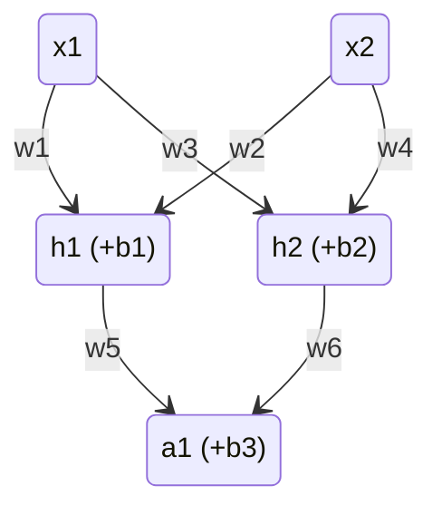

# neural network

## Learning cycle

1. Taking the input data `x`
2. Making a prediction using `w` and `b`
3. Comparing the prediction to the desired output with function like mse
4. Back propagate the model and get the gradients of the `w` and `b`
5. Apply the gradients using learning rate
6. Repeat the cycle

## Forward pass (predicting)

1. Every layer is liner layer means the its looks like

   $$f(x) = (weight_1 \cdot x_1) + (weight_2 \cdot x_2) + bias$$
   `or`
   $$f(x) = weight_1\cdot x^2 + weight_2\cdot x + bias$$

2. in between layers there is non linear function like `sigmoid` function but it needs to be differentiable

## Backward pass (teaching the network) using gradient descent

0. forward pass
1. calculate error using function like `mse` that gets the prediction and the ground truth and output calculated error
2. from the error function derive each layer back
3. apply the derivative to the parameters `w` and `b`

### Network example:

- we have activision function `sigmoid` on every neuron
- at the end we use the loss function: `mse`

## Forward pass

$$n_1(x_1,x_2) = x_1w_1 + x_2w_2  + b_1$$

$$h_1 = f(n_1)$$

$$n_2(x_1,x_2) = x_1w_4 + x_2w_3 + b_2$$

$$h_2 = f(n_2)$$

$$o_1(h_1,h_2) = h_1w_6 + h_2w_5 + b_3$$

$$a_1 = f(o_1)$$

$$mse(y_{true}, y_{pred}) = (y_{true} - a_1)^2$$

> on every layer there is an activision function:
> $$f(x) = sigmoid(x) = \frac{1}{1+e^{-x}}$$

## Gradient descent

we can write the loss function using the weights:

$$L(w_1,w_2,w_3,w_4,w_5,w_6,b_1,b_2,b_3)$$

- mse derivative: $mse(y_{true}, y_{pred})' = -2(y_{true} - y_{pred})$
- sigmoid derivative:
  $$
  f(x)' = (\frac{1}{1+e^{-x}})' = \frac{e^{-x}}{(1+e^{-x})^2} = f(x)\cdot(1-f(x))
  $$

then to derive parameter we will use the chain rule:

$$
n1: \frac{\partial L} {\partial w_{1..2}} = \frac{\partial L} {\partial a_1}\cdot\frac{\partial a_1} {\partial h_1}\cdot\frac{\partial h_1} {\partial w_{1..2}}
$$

$$
n2: \frac{\partial L} {\partial w_{3..4}} = \frac{\partial L} {\partial a_1}\cdot\frac{\partial a_1} {\partial h_2}\cdot\frac{\partial h_2} {\partial w_{3..4}}
$$

$$
o1: \frac{\partial L} {\partial w_{5..6}} = \frac{\partial L} {\partial a_1}\cdot\frac{\partial a_1} {\partial w_{5..6}}
$$

we can calculate $\frac{\partial L}{\partial a_1}$ because its $mse$ derivative

$$\frac{\partial L}{\partial y_{pred}} = -2(y_{true}-y_{pred})$$

so simplifying the derivatives and writing them with parameters:

$$
n_{1 (w_{1..2})}: -2(y_{true} - a_1) \cdot w_5f'(w_5h_1 + w_6h_2 + b_3)\cdot x_{1..2}f'(w_1x_1 + w_2x_2 + b_1)
$$

$$
n_{2 (w_{3..4})}: -2(y_{true} - a_1) \cdot w_6f'(w_5h_1 + w_6h_2 + b_3)\cdot x_{1..2}f'(w_3x_1 + w_4x_2 + b_2)
$$

$$
o_{1 (w_{5..6})}: -2(y_{true} - a_1) \cdot h_{5..6}f'(w_5h_1 + w_6h_2 + b_3)
$$
